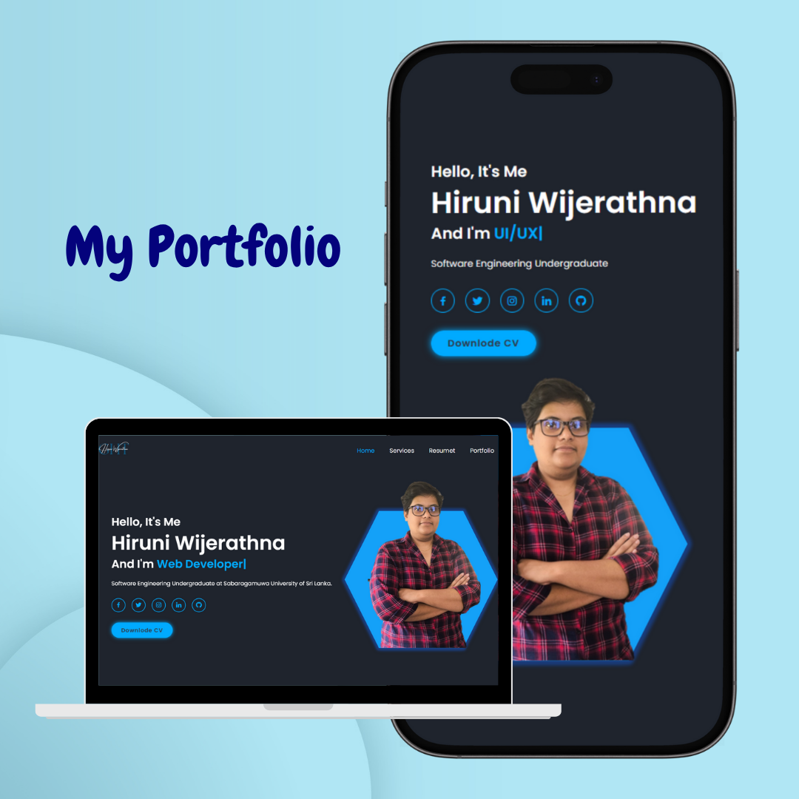

# 💻 Personal Portfolio Website – Hiruni Wijerathna 🌟

  

I’ve highlighted my **projects**, **skills**, and a glimpse into my journey as a **Software Engineering student**.

---

## ✨ About the Portfolio

This portfolio serves as a central hub to showcase:

- 💼 My **projects**, academic work, and **work experience**
- 🧠 My **technical skills**, tools, and technologies
- 📜 My **resume**, **certifications**, and achievements
- 🧑‍💻 A brief story of my path as a passionate developer
- 🌐 Easy ways to **connect with me**

---

## 🛠️ Built With

- 🌐 **HTML5** – Markup structure  
- 🎨 **CSS** – Styling and animations  
- ⚙️ **JavaScript** – Interactivity and smooth scroll  
- 📱 **Responsive Web Design** – Mobile-first, flexible layout

---

## 🔗 Live Demo

🌍 [View Portfolio Website](https://hiruniwijerathna.github.io/My-profile/)  

